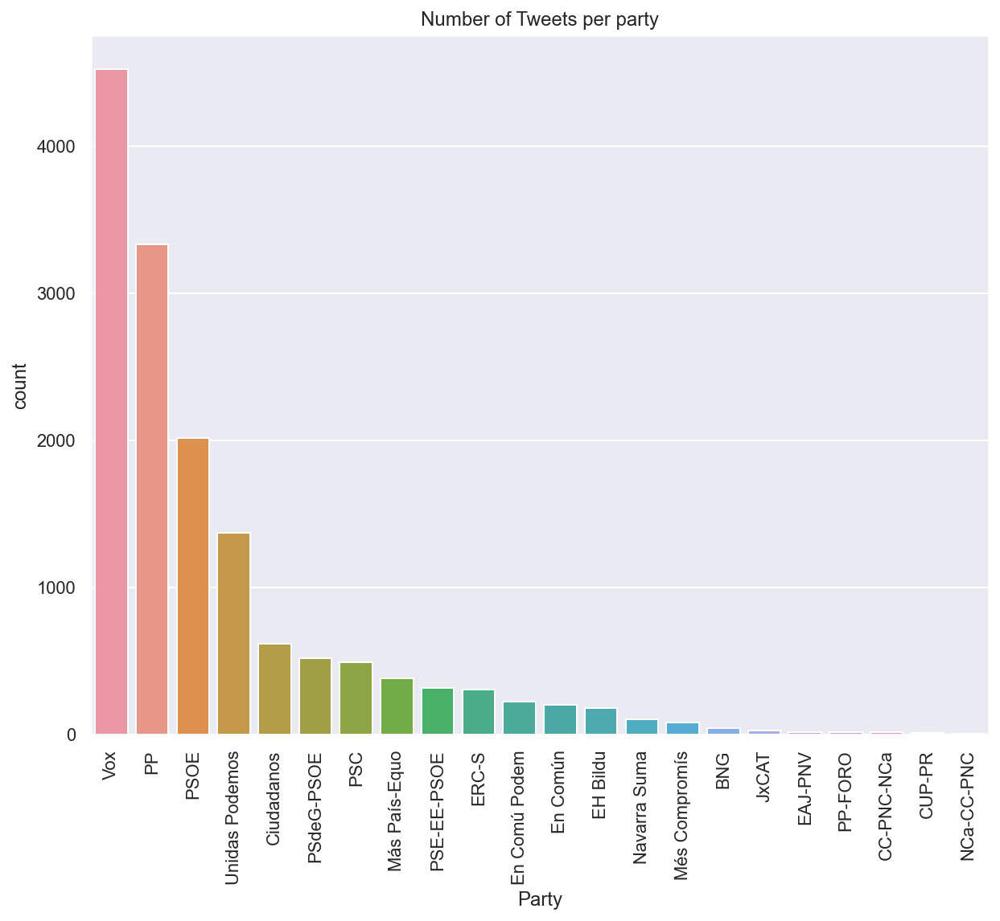
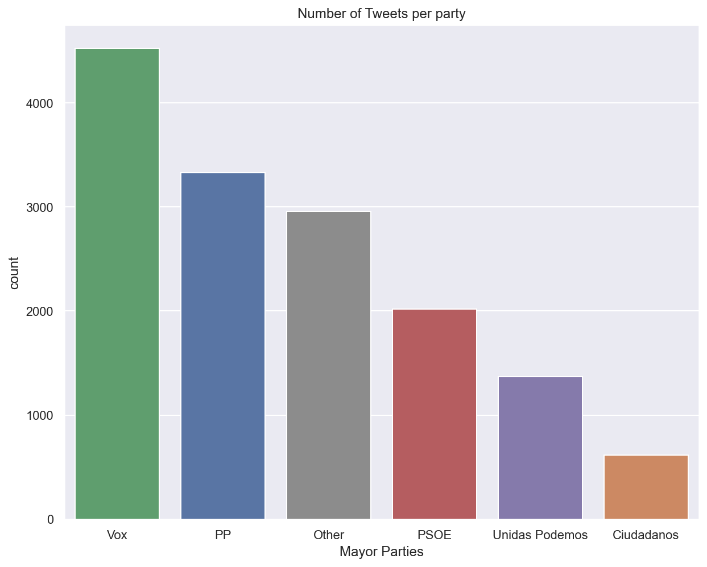

# NLP-Spanish-Politicians-Tweets
The aim of this project is to analyse and process **Tweets published by Spanish Congress politicians** during the month **(07/04/2021 - 07/05/2021)** using **NLP**.

The tweets have been stored in a custom database with the help of **Twitter’s API**. The text has been pre-processed and parsed to later obtain their semantic relationship. The analysis offers useful,  up-to-date insights and, in addition, the use of this type of text will be less likely to contain spelling mistakes or abbreviations.

## How to use the code
The analysis of the tweets and results are presented in the **Jupyter Notebooks**.
The main code is organized in 4 folders: 
- `main directory`: contains the notebooks, the required libraries to install and the main.py code.
- `data`: store all our dataframes, such as the scrapped and parsed dataset (data.csv) or the lda dataframe (final_tm_df.xlsx)
- `models`: store all the saved models from the notebooks, such as LDA models and Bag of Words.
- `nlp`: contains all the scraper code and the NLP pipeline, which takes the raw scraped tweets and parses them.

in order to run the code yo will need to install the requirements 
```
pip install -r requirements.txt
```
 
### Scraping the data
You need a **Twitter API key** to scrape the data.
Once you get that you will have to put it on the file  `nlp/config.py` in the placeholders marked by `<KEY_HERE>`

After the Scraping of the data, one commented cell in the notebook `task1_nlp.ipynb` calls the parser that cleans the data writes it on a csv `data/data.csv`. You can skip that part and already use this file.

### Exploratory Data Analysis
We can first plot the number of tweets that each party has tweeted over the selected period of time (1 month)



As we can see there is a mayor difference between the number of tweets of the mayor parties and the minor ones so we will aggregate the ones that are not in the top 5 into one category `Other` and plot again

